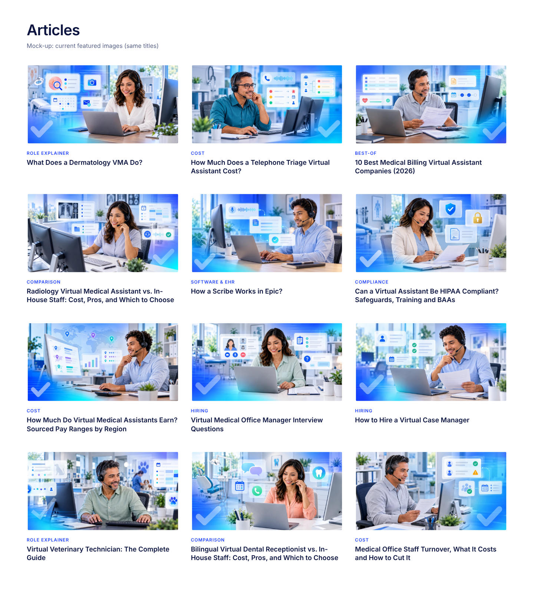
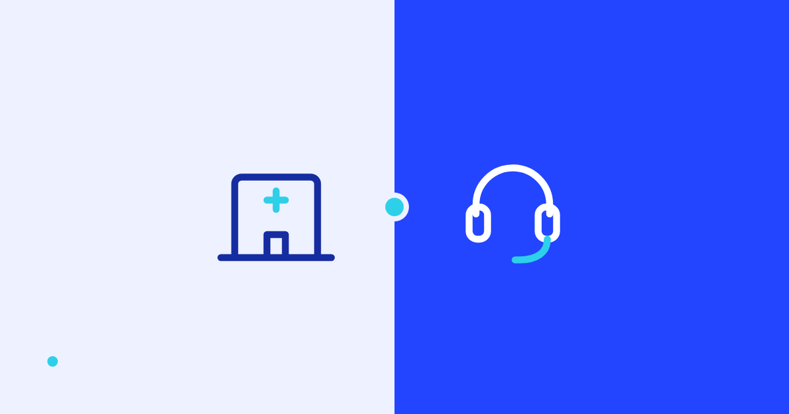
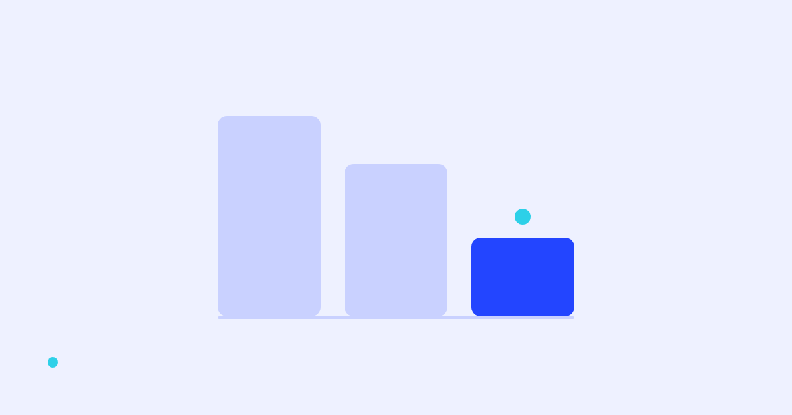
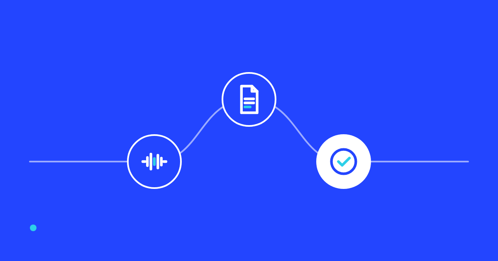
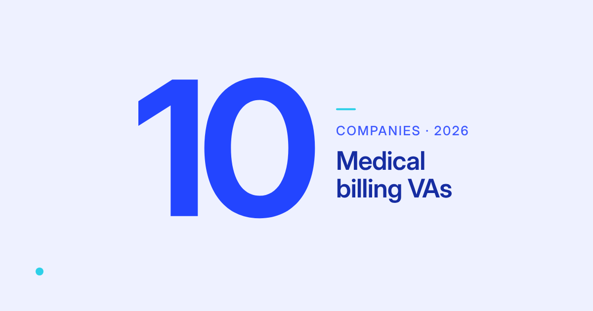
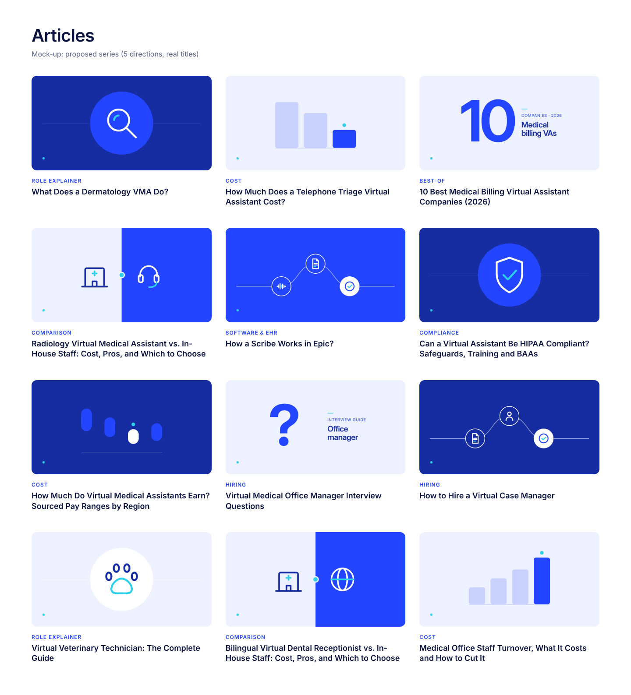

# Honest Taskers blog images: audit and design system

Prepared 2026-10-06. Covers Steps 1–5 of the brief. The AI prompts are in [PROMPTS.md](PROMPTS.md).

---

## 0. Read this first: what I could and could not see

**The live sites were unreachable from this session.** The environment's network policy returned `403` for every host involved:

| Host | Headless Chromium | curl | Server-side fetch |
|---|---|---|---|
| `www.rippling.com` | `ERR_TUNNEL_CONNECTION_FAILED` | `CONNECT 403` | `EGRESS_BLOCKED` |
| `calendly.com` | `ERR_TUNNEL_CONNECTION_FAILED` | `CONNECT 403` | `EGRESS_BLOCKED` |
| `honesttaskers.com` | `ERR_TUNNEL_CONNECTION_FAILED` | `CONNECT 403` | `EGRESS_BLOCKED` |
| Common image CDNs (ctfassets, sanity, webflow, prismic) | blocked | blocked | — |

A realistic user agent doesn't help: the block sits in the session's egress policy, not in the sites themselves. The full capture script is written and tested up to that block ([research/capture.js](research/capture.js)).

**What that means for each step:**

- **Step 2 (Rippling and Calendly analysis): not done.** Your rule is that every claim about a site must come from an image I viewed. I viewed none of theirs, so this report says nothing about how those blogs look. Section 2 explains how to finish it.
- **Step 3 (your images): done thoroughly, from a better source than the website.** This repo holds the featured images themselves: 1,926 WebP files across 441 batches, plus manifests that map each image to its article title. I measured all of them, looked at 72 spread evenly from `batch-001` to `batch-435`, and looked at 3 at full size. The one thing I could **not** see is your live listing page (its card ratio, corner radius and page background). The grid mock-ups below therefore use a neutral 3-column card layout, not your real CSS.
- **Steps 4–6: done.** They are built from the audit and from general editorial-design practice. Rules in this report that would normally come from Rippling or Calendly are labelled **working rule**. Check them against those sites once access is open.

**To finish Step 2:** add `www.rippling.com`, `calendly.com`, `honesttaskers.com` and their image CDNs under *Allowed domains* in the environment's network settings ([docs](https://code.claude.com/docs/en/cloud-environments#network-access)). Then run `PW_MODULE=/opt/node-tools/node_modules/playwright node blog-image-research/research/capture.js` and ask me to complete Section 2.

**Font:** Sequel Sans is not installed here. All renders use **Inter Display / Inter** as the fallback. [templates/base.css](templates/base.css) has a commented `@font-face` block: drop the Sequel Sans `.woff2` files beside it and re-render.

---

## 1. Capture log (Step 1)

| Item | Result |
|---|---|
| Playwright | Node Playwright and Chromium were already installed. Nothing was installed. |
| Reference and own index screenshots (1440 / 390) | Blocked (see §0) |
| Your featured images | 1,926 files in `batches/*/`; **1,921 readable, all exactly 1200×630 (1.905:1)**, WebP |
| Corrupt files | 5 in `batch-343` are not valid WebP (`what-a-bariatric-vma-does`, `what-does-a-bariatric-vma-do`, `tasks-to-delegate-in-a-bariatric-practice`, `tasks-to-delegate-in-a-fertility-practice`, `what-are-the-benefits-of-a-fertility-vma`). If those went live, the posts show broken images. |
| Distinct article titles | 1,903 |
| Viewed | 72 sampled images (list in [research/honesttaskers/audit-sample-files.txt](research/honesttaskers/audit-sample-files.txt)), 3 at full size, and 12 more in a mock grid |

Sample sheets (each holds 12 images, in batch order):


All six: [1](research/honesttaskers/audit-sheet-1.jpg) · [2](research/honesttaskers/audit-sheet-2.jpg) · [3](research/honesttaskers/audit-sheet-3.jpg) · [4](research/honesttaskers/audit-sheet-4.jpg) · [5](research/honesttaskers/audit-sheet-5.jpg) · [6](research/honesttaskers/audit-sheet-6.jpg)

---

## 2. Reference sites (Step 2): blocked

I make no claims here about Rippling's or Calendly's images, because I could not view any of them.

Once capture runs, each site gets the same template:

| Dimension | What I'll record |
|---|---|
| Composition | Focal-object count and placement, share of negative space (measured, not guessed) |
| Color | Background treatment, colors per image (palette quantization), how accent color is used |
| Typography | Text present or not, word count, weight and size relative to the canvas |
| Imagery | 3D, flat, UI crop, photo, icon or geometric |
| Series mechanics | What repeats from post to post and what changes |
| Density | Whitespace ratio |
| Ratio and crop | Native image ratio vs. listing card ratio vs. article hero ratio |

I'll then write 6–8 rules per site and re-score Section 3's comparison table against them.

### Working rules used in place of Step 2

These come from general editorial-design practice, not from the reference sites. Steps 4–5 are built on them, and they're the rules I'll re-check against the references.

1. **One focal object per image.** It takes up 25–45% of the canvas height, and 55%+ of the canvas is empty field.
2. **Flat fields, few colors.** Each image uses one background color plus at most two ink colors. No photographic backgrounds.
3. **The accent is a single element.** It is never a wash or a field.
4. **The image never repeats the title.** Where type appears at all, it's ≤ 6 words and reads at card size.
5. **The series is held together by rules, not by repeating one picture.** Shared stroke weight, palette, margins and a signature mark do the work; the subject changes every time.
6. **The image says the article type at a glance.** Cost, comparison, list and how-to posts should look different from each other.
7. **The subject sits in a centre safe zone** so 16:9, 4:3 and 1:1 crops all keep it.
8. **No people unless they're real.** Synthetic stock people cost a healthcare brand credibility.

---

## 3. Audit of your images (Step 3)

### The formula

Every image I viewed (72 of 72) is the same composition:

> An AI-generated person (25–55, smiling, wearing a **headset**) at a desk with a laptop or monitor, a potted plant and papers. A bright clinic is blurred behind them. **3–6 floating frosted-glass UI cards** with placeholder lines and small icons hover around them. A **blue→cyan gradient wash and light streaks** come in from one or two corners, and a **large translucent checkmark** sits in a bottom corner. Each image also has an **8px white frame** baked in.

The only thing that changes from post to post is the small icon inside one or two cards: a tooth, a paw, a kidney, an x-ray.

Close-ups:

| | |
|---|---|
|  |  |
|  | |

### Issues, ranked

| # | Issue | Evidence (seen or measured) | Severity |
|---|---|---|---|
| 1 | **One picture for 1,900 articles.** The series identity is "smiling headset person + floating cards", so every card looks the same and the reader has no reason to stop on any one of them. | 72/72 sampled share the composition; see the "before" grid below | **High** |
| 2 | **Synthetic stock people.** Glossy AI faces, a handful of repeated archetypes, identical poses (hand to headset, holding a paper). Practice owners see this look in ads every day. It reads as generic or AI, and it implies these are your VAs when they aren't. | Every sampled image | **High** |
| 3 | **Corner checkmark badge.** A big translucent tick sits in almost every image. It means nothing about the article and borrows the visual language of ad creatives ("approved!"). Across a grid it repeats like a watermark. | Visible in essentially all 72 (faint on a few) | **High** |
| 4 | **No focal point; UI-card clutter.** 3–6 glass cards, each with 3–8 placeholder bars and 1–3 icons, add up to roughly 10–20 small elements per image. At a ~400px card width the bars turn to noise and the specialty icon (the only differentiator) is about 15px tall. | Full-size views; mock grid | **High** |
| 5 | **The image doesn't signal article type.** A cost post, a "vs." post, a top-10 list and an interview-questions post look identical. *"Radiology VMA vs. In-House Staff"* shows one person, with nothing being compared. | 12-card "before" grid | **High** |
| 6 | **Gradients, glow and glassmorphism.** Blue→cyan washes, light streaks, frosted cards and soft shadows on every image. Taken together they read as template-store or ad, not editorial. | Every sampled image | **Med** |
| 7 | **Off-brand colors.** Wood desks, green plants, skin tones and warm clinic light, plus **red/yellow/green status dots**, **orange coins**, a **yellow padlock**, purple chips and an **orange warning triangle**. In a 200-image sample, a median **46% of pixels** sit far from your 5-color kit (RGB distance > 90 from every brand color). | Measurement + close-ups | **Med** |
| 8 | **Baked-in 8px white frame.** It shows up as a white inset inside the card (visible in the "before" grid) and fights any rounded corner or tinted card background. | 200/200 measured: exactly 8px on all four sides | **Med** |
| 9 | **Crop fragility.** The person sits on the left or right third and the cards on the other. A centre 4:3 or 1:1 crop (mobile cards, social) cuts a face or the card cluster. | Composition in all samples | **Med** |
| 10 | **Clickbait micro-cues.** Warning triangles, red alert sirens, "?" bubbles and red "X" marks inside the cards. Small, but they add urgency the article doesn't earn. | e.g. turnover post (⚠), triage post (siren), batch-139 (✗) | **Low** |
| 11 | **No text on images.** This is right. Titles aren't repeated and there are no emojis or exclamation marks. Keep it. | 72/72 | ✓ |
| 12 | **Hygiene.** 5 corrupt files, plus near-duplicate posts such as *"What Does a Dermatology VMA Do?"* / *"What a Dermatology VMA Does?"* and the stray "?" in *"How a Scribe Works in Epic?"*. That's an SEO problem, not a design one, but it adds to the content-farm impression. | Manifests | **Low** |

### Image by image (the 12 in the grid mock)

| Article | What I see | Main problem |
|---|---|---|
| What Does a Dermatology VMA Do? | Woman with headset, laptop; cards with a skin/magnifier chip, camera, calendar dots, mail | Dermatology cue is one small chip; the rest is generic |
| How Much Does a Telephone Triage VA Cost? | Man in glasses; triage cards with red/yellow/green rows and a red siren | Nothing says "cost"; traffic-light colors are off-brand |
| 10 Best Medical Billing VA Companies (2026) | Man holding paper; generic list cards | Nothing signals a ranked list; could be any post |
| Radiology VMA vs. In-House Staff | Woman at dual monitors; x-ray card | A comparison post with nothing compared |
| How a Scribe Works in Epic? | Man at laptop; waveform → doc → check card chain | The best idea in the set (a flow), buried under a stock person |
| Can a VA Be HIPAA Compliant? | Woman in blazer; shield, **yellow padlock**, doc | Compliance cue present but off-palette; stock-person trust problem is worst on a trust topic |
| How Much Do VMAs Earn? (by region) | Man; monitor with a world map and pins, bar chart | Closest to the subject, still cluttered |
| Office Manager Interview Questions | Woman; video-call card, "?" bubble | Generic |
| How to Hire a Virtual Case Manager | Man reading paper; generic list cards | Interchangeable with ~200 hiring posts |
| Virtual Vet Technician: Complete Guide | Man; faint paw and cat chips; vet staff with dog blurred behind | Vet cue nearly invisible at card size |
| Bilingual Dental Receptionist vs. In-House | Woman; tooth chip, purple/pink chat bubbles | Comparison not shown; extra colors |
| Staff Turnover: What It Costs | Man; people card with an **orange ⚠** | Alarm cue; no cost signal |

### The grid as a whole

**Desktop:** a wall of near-identical blue-washed photos. The eye has nothing to anchor on, the category label and title do all the work, and the checkmarks line up in the same corner row after row like a watermark.



**Mobile:** each card is a cluttered thumbnail with a face and UI fragments. The specialty icon (the only unique element) is about 10px tall. See [renders/contact-sheet-before-390.png](renders/contact-sheet-before-390.png).

### Current images against the working rules

| Working rule | Current images | Proposed system |
|---|---|---|
| 1 focal object, 55%+ empty field | ✗ person + 3–6 cards + checkmark; under 15% empty | ✓ one object or one structure; 60–75% field |
| Flat field, ≤ 3 colors | ✗ photo + gradient; ~46% off-palette pixels | ✓ 1 field + ≤ 2 inks, kit colors only |
| Accent is one element | ✗ cyan wash everywhere, plus red/yellow/orange chips | ✓ one teal element + the signature dot |
| No title on the image; type ≤ 6 words | ✓ no text | ✓ no text, except Direction E (≤ 6 words) |
| Series held by rules, subject varies | ✗ series held by repeating one picture | ✓ shared stroke, margins, palette, signature dot |
| Says the article type at a glance | ✗ every type looks the same | ✓ one direction per type |
| Subject in centre safe zone | ✗ subject on thirds | ✓ key art inside the 1:1 centre zone |
| No synthetic people | ✗ AI people in every image | ✓ none |

---

## 4. Design system and five directions (Step 4)

### Your categories, from the 1,903 titles

| Category (keyword match) | Posts | Direction |
|---|---|---|
| Role explainers: "What does / is", "A day in the life", skills, "complete guide" | 382 | **A Object Study** |
| Best-of lists: "N Best … Companies (2026)" | 353 | **E Numeral Plate** |
| Comparisons: "… vs. In-House Staff" | 251 | **B Two Fields** |
| Hiring: how to hire, job descriptions, interview questions, training | 245 | **D Path** (process) / **E** (question sets) |
| Cost and pay: cost, pricing by hours, earn, ROI | 211 | **C Quiet Metric** |
| Tasks and benefits: "Tasks to delegate", "Benefits for …" | 143 | **D Path** |
| Software and EHR: "How a biller works in Dentrix", Epic, DrChrono | 108 | **D Path** |
| Compliance: HIPAA, PHI, BAAs | 29 | **A Object Study**, deep field only |
| Other: outsourcing services, answering-service FAQs | 181 | **A**, or **E** for "Common Questions" |

### System rules shared by all five directions

| Spec | Value |
|---|---|
| Master canvas | **1200×630** (OG image; matches your existing files, so the CMS needs no change) |
| Listing-card ratio | Your live grid couldn't be inspected. All five directions are built to survive **16:9 (1120×630), 4:3 (840×630) and 1:1 (630×630) centre crops**. |
| Safe zone | Key art stays inside the **1:1 centre zone: x 285–915**. Type (Direction E only) stays inside the **4:3 zone: x 180–1020**. See [renders/safe-zones/_overview.png](renders/safe-zones/_overview.png). |
| Margins and grid | 72px outer margin (6 × 12px baseline); 12-column grid, 72px columns, 24px gutters |
| Fields | `#162da1` deep, `#2345ff` primary, or `#eef1ff` light tint. **Never pure white**: white cards disappear into a white page (I tested this; see §5). |
| Inks | `#ffffff`, `#162da1`, `#2345ff`, `#3e59ff`; tint `#c9d1ff` for de-emphasised shapes |
| Accent | `#2dd0e8` teal on **one element per image**, plus the signature dot. Never a fill field or gradient. |
| Max colors | 1 field + 2 inks + teal |
| Signature | A 16px teal dot, centred 72px from the bottom-left corner, in every image. It's the quiet series mark. It falls outside the 1:1 crop by design, so square crops stay pure. |
| Icon style | Original monoline set ([templates/icons.js](templates/icons.js)): 120-unit grid, round caps and joins, no fills. Stroke **5–9 units** on the 120-unit grid (bigger icons get the lower number), so drawn lines land between 6.3px and 12.5px at 1200w. Never thinner than 2px once scaled to a 400px card. |
| Corner radius | 14px on bars; circles for plates and nodes. The image itself has **no** corner radius or frame; the site's card applies the radius. |
| Never | People, photos, gradients, drop shadows, glass or blur, checkmark badges, arrows-as-hype, red/orange/yellow, emojis, more than one focal object, the article title |

---

### A. Object Study

**Concept:** one object from the practice, drawn large and calm, so the post is about *that role* and nothing else.

**Use for:** role explainers, "a day in the life", skills, complete guides. Compliance posts use the deep field with a shield or lock.

**Specs:**
- **Field:** deep `#162da1` (default), primary `#2345ff`, or light `#eef1ff`. Compliance is always deep.
- **Plate:** a 420px circle centred at (600, 315), one step lighter than the field (or white on the light field).
- **Object:** 300px, centred, stroke 5 in white (or deep ink on light). The icon's `.ac` element is teal.
- **Horizon:** a 2px rule across the canvas at y 315, 14–18% white.
- **Text:** none.
- **Variable:** `icon`, chosen by specialty: tooth (dental), paw (vet), magnifier (derm), stethoscope (general), heart (cardio), eye (ophthalmology), ear (ENT), brain (behavioural), rx (pharmacy), spine (chiro), shield/lock (compliance).

**Do:** one object; let the field breathe; rotate the three fields by specialty, not at random.
**Don't:** add a second object, badge or label; draw specialty icons with fills; put the teal on more than the icon's accent stroke.

**Examples:**
- *What Does a Dermatology VMA Do?* → magnifier with a teal lens glint, deep field. [render](renders/a1-what-does-a-dermatology-vma-do.png)
- *A Day in the Life of a Bilingual Virtual Dental Receptionist* → tooth with a teal highlight, primary field. [render](renders/a2-day-in-the-life-bilingual-virtual-dental-receptionist.png)
- *Can a Virtual Assistant Be HIPAA Compliant? Safeguards, Training and BAAs* → shield with a teal check, deep field. [render](renders/a3-can-a-virtual-assistant-be-hipaa-compliant.png)
- Bonus: *Virtual Veterinary Technician: The Complete Guide* → paw with a teal pad, light field. [render](renders/a4-virtual-veterinary-technician-complete-guide.png)


---

### B. Two Fields

**Concept:** the comparison is the composition. Two flat fields meet at a seam, each holding one object.

**Use for:** every "X vs. In-House Staff: Cost, Pros, and Which to Choose" post (251), and other A-vs-B posts.

**Specs:**
- **Layout:** left half `#eef1ff` (the incumbent, e.g. in-house); right half `#2345ff` (the virtual option).
- **Objects:** 210px, centred at x 420 and x 780, so both survive a 1:1 crop. Stroke 6. The left object is deep ink with no accent; the right object is white with a teal accent.
- **Seam:** a 28px teal dot at (600, 315) with an 8px tint ring. This is where "vs." would be, without the letters.
- **Text:** none.
- **Variables:** `left` (clinic by default), `right` (headset, laptop, globe for bilingual or offshore).

**Do:** keep virtual on the right in every post (the series learns the convention); swap only the right-hand object per role.
**Don't:** add "VS"; make one side bigger than the other (that's a sales thumbnail); add a third object.

**Examples:**
- *Radiology Virtual Medical Assistant vs. In-House Staff* → clinic \| headset. [render](renders/b1-radiology-vma-vs-in-house-staff.png)
- *Bilingual Virtual Dental Receptionist vs. In-House Staff* → clinic \| globe. [render](renders/b2-bilingual-virtual-dental-receptionist-vs-in-house.png)
- *Chiropractic Virtual Medical Assistant vs. In-House Staff* → clinic \| laptop (the right object stays generic; the specialty lives in the article). (Same template; not rendered.)



---

### C. Quiet Metric

**Concept:** the shape of the number, never the number itself. An unlabelled bar or range chart in which one bar carries the story.

**Use for:** cost, pricing by hours, pay ranges, ROI, turnover cost.

**Specs:**
- **Field:** light `#eef1ff` or deep `#162da1`.
- **Chart box:** x 330–870, y 150–480 (inside the 1:1 zone). 3–5 bars with 36px gaps; when bars float, they become pills with 84px gaps so they read as ranges.
- **Colors:** bars in tint `#c9d1ff` (or `#2345ff` on deep); the hero bar in `#2345ff` (or white on deep); a 24px teal marker dot 20px above the hero bar.
- **Baseline:** 4px rule.
- **Text:** none. No axis labels, no $, no numbers. Numbers on a thumbnail are a promise the image can't source.
- **Variables:** `bars` as `[from, to]` pairs, and `hi`, the index of the hero bar.

**Do:** pick the shape from the article's actual claim: descending for "costs less", rising for "turnover costs add up", floating ranges for pay bands.
**Don't:** add currency symbols, arrows, up/down emojis, red bars or gridlines.

**Examples:**
- *How Much Does a Telephone Triage Virtual Assistant Cost?* → three descending bars; the short one is the hero. [render](renders/c1-telephone-triage-va-cost.png)
- *How Much Do Virtual Medical Assistants Earn? Sourced Pay Ranges by Region* → four floating range pills on deep; one region highlighted. [render](renders/c2-how-much-do-vmas-earn-by-region.png)
- *Medical Office Staff Turnover, What It Costs and How to Cut It* → four rising bars; the tallest is the hero. [render](renders/c3-medical-office-staff-turnover-costs.png)



---

### D. Path

**Concept:** work moving through hands. Three nodes on one continuous line, where the last node is the outcome.

**Use for:** how-to, how to hire, software and EHR workflows ("How a biller works in Dentrix"), tasks to delegate, benefits.

**Specs:**
- **Field:** `#2345ff` or `#162da1`.
- **Line:** one bezier from the left margin to the right margin, 4px, 55% white.
- **Nodes:** 132px circles at (372, 390), (600, 240), (828, 390), all inside the 1:1 zone. The first two are outlined (4px white); the last is filled white.
- **Icons:** 84px, stroke 9, white. The final node's icon is blue with a teal accent.
- **Text:** none.
- **Variable:** `steps`, three icon names. For example: wave → document → check (scribe); document → person → check (hiring); clipboard → calendar → spine (chiro tasks).

**Do:** always use exactly 3 nodes; finish on the outcome; use the specialty icon as the final node when it makes sense.
**Don't:** add arrows, number the steps, add a fourth node or put text in the nodes.

**Examples:**
- *How a Scribe Works in Epic?* → wave → document → check. [render](renders/d1-how-a-scribe-works-in-epic.png)
- *How to Hire a Virtual Case Manager* → document → person → check, deep field. [render](renders/d2-how-to-hire-a-virtual-case-manager.png)
- *Tasks to Delegate in a Chiropractic Practice* → clipboard → calendar → spine. [render](renders/d3-tasks-to-delegate-chiropractic-practice.png)
- *Can a Virtual Assistant Work in Your EHR? How Remote Access Works* → lock → laptop → document. (Same template; not rendered.)



---

### E. Numeral Plate

**Concept:** the editorial cover. One oversized numeral and a few quiet words. It's the only direction with type, because a ranked list *is* a number.

**Use for:** "N Best … Companies (2026)" (353 posts), interview-question sets and "Common Questions" FAQ posts. For posts without a count, use "?".

**Specs:**
- **Field:** `#eef1ff` or `#162da1`.
- **Numeral:** 380px, weight 700, tracking −0.05em, `#2345ff` (white on deep), starting at x 285. "?" uses the same size.
- **Text block:** at x 680, 300px wide. A 40×4px teal tick, then a 26px uppercase eyebrow (tracking 0.1em, `#3e59ff`, or teal on deep), then a 52px label at weight 600, line height 1.08, deep ink.
- **Type rules:** the label is **2–4 words, 6 maximum** across label and eyebrow combined, sentence case, no punctuation, **never the title**. Sequel Sans when available; the fallback is Inter Display.

**Do:** use the real count from the title; keep the label to the role ("Pharmacy VAs").
**Don't:** use "Top", "Best", "Ultimate", years in the numeral, exclamation marks, stars or medals.

**Examples:**
- *10 Best Medical Billing Virtual Assistant Companies (2026)* → "10" / COMPANIES · 2026 / Medical billing VAs. [render](renders/e1-10-best-medical-billing-va-companies-2026.png)
- *7 Best Pharmacy Virtual Assistant Companies (2026)* → "7" on deep / Pharmacy VAs. [render](renders/e2-7-best-pharmacy-va-companies-2026.png)
- *Virtual Medical Office Manager Interview Questions* → "?" / INTERVIEW GUIDE / Office manager. [render](renders/e3-virtual-medical-office-manager-interview-questions.png)
- Also fits: *Medical Answering Service: Common Questions* → "?" / FAQ / Answering service.



---

## 5. Templates and renders (Step 5)

```
templates/
  base.css                tokens: palette, margins, signature dot, crop guides
  icons.js                original monoline icon set + helpers
  a-object-study.html     ?spec={"icon":"tooth","field":"deep|blue|light"}
  b-two-fields.html       ?spec={"left":"clinic","right":"headset"}
  c-quiet-metric.html     ?spec={"bars":[[0,.9],[0,.6],[0,.3]],"hi":2,"field":"light|deep"}
  d-path.html             ?spec={"steps":["phone","calendar","check"],"field":"blue|deep"}
  e-numeral-plate.html    ?spec={"num":"10","eyebrow":"Companies · 2026","label":"Medical billing VAs","field":"light|deep"}
  jobs.json               title -> template + spec (15 real titles)
  render.js               node render.js [jobs.json] [outDir] [--guides]
  contact-sheet.html      mock blog index (before/after, desktop/mobile)
  render-contact-sheets.js
```

To make a new image, add an entry to `jobs.json` and run `PW_MODULE=/opt/node-tools/node_modules/playwright node templates/render.js`. Add `--guides` to overlay the 16:9, 4:3 and 1:1 crop lines.

**What I fixed after looking at my own renders:**
- The tooth's accent read as a smiley; it's now a highlight on the crown.
- The paw's toes were crowded, so I spread them.
- The chiropractic "bone" read as a chain link; I replaced it with a spine.
- Path icons were too thin at card size; stroke went from 7 to 9 and size from 72 to 84.
- "Q&A" overflowed the 1:1 safe zone; I replaced it with "?".
- The eyebrow text was about 7px at card size; it went from 22 to 26px and the label from 44 to 52px.
- Floating range bars looked like random blocks; they're now pills with wider gaps.
- **White-field cards disappeared into the white page** in the grid mock, so every light field is now `#eef1ff`.

**Contact sheet: proposed series, 12 real titles, desktop:**



Mobile: [after](renders/contact-sheet-after-390.png) · [before](renders/contact-sheet-before-390.png). Individual PNGs are in [renders/](renders/).

**Known limits of the renders:**
- Inter stands in for Sequel Sans, which will change Direction E's numerals the most.
- The mock grid is neutral, not your site's CSS.
- The icon set covers about 25 subjects; add icons to `icons.js` at the same 120-unit grid and stroke.

---

## 6. Rollout notes

- **Re-render, don't regenerate.** Directions B–E are deterministic code, so 1,900 images can be re-rendered in minutes from a title→spec mapping. Direction A can be code (as here) or AI-generated with the prompts in PROMPTS.md.
- **Start with the posts that look most alike:** the 251 "vs. In-House" posts (B) and the 353 "N Best" posts (E). Their titles already contain everything the spec needs, so the mapping can be automated.
- **Remove the 8px white frame** from any image you keep.
- **Fix the 5 corrupt `batch-343` files** before anything else ships.
